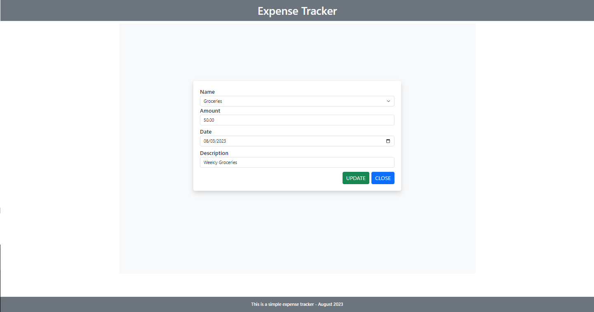

## EXPENSE TRACKER

---

###### 2nd Readme.md I created Aug 24, 2023

Expense Tracker:
Develop an expense tracking application where users can log their expenses, categorize them, and view reports. This project can teach you about data visualization and filtering.

#### 1. Setup

    Database Server (MySQL)
        -expense_tracker (database named)
            - expenses (table)
            - categories (table)

Categories table (Parent table)

```SQL
Create table categories(
	id int auto_increment primary key,
    name varchar(255) not null
);

INSERT INTO categories (name)
VALUES ("Groceries"),
       ("Entertainment"),
       ("Transportation"),
       ("Utilities");
```

Expenses table (Child table)

```SQL
CREATE TABLE expenses(
	id INT AUTO_INCREMENT PRIMARY KEY,
    category_id INT,
    amount DECIMAl(10, 2) NOT NULL,
    date DATE NOT NULL,
    description VARCHAR(255) NOT NULL,
    FOREIGN KEY (category_id) REFERENCES categories(id)

);

INSERT INTO expenses(category_id, amount, date, description)
VALUES
    ((SELECT id FROM categories WHERE name = 'Groceries'), "50.00", "2023-08-01", "Groceries Shopping"),
    ((SELECT id FROM categories WHERE name = 'Entertainment'), "20.00", "2023-08-02", "Movie night with Friends"),
    ((SELECT id FROM categories WHERE name = 'Transportation'), "10.00", "2023-08-03", "Bus fare to work"),
    ((SELECT id FROM categories WHERE name = 'Groceries'), "35.00", "2023-08-04", "Weekly Groceries"),
    ((SELECT id FROM categories WHERE name = 'Utilities'), "80.00", "2023-08-05", "Electricity bill");
```

To associate each _expenses_ with a specific category*id based on the category name. Perfrom a lookup in the \_categories* to find the correspond in **category_id** `(SELECT id FROM categories WHERE name = 'Groceries')`

#### 2. Create Folder in Xampp/htdocs

    - C:\xampp\htdocs\crud_expense_tracking

#### 3. Open folder in your vscode editor

##### Create config file to connect the database.

_config.php_

```php
<?php
define('HOSTNAME', "localhost");
define('USERNAME', "root");
define('PASSWORD', "");
define('DATABASE', "crud_expense_tracker");

//connect to the database
$connection = mysqli_connect(HOSTNAME, USERNAME, PASSWORD, DATABASE);

if (mysqli_connect_errno()) {
    die("Connection failed: " . mysqli_connect_error($connection));
} else {
    echo "Connected successfully";
}
?>
```

##### Create your initial main file

_index.php_

###### There I included bootstrap links

```php
<?php session_start();?>
<?php include('config.php');?>

<!DOCTYPE html>
<html lang="en">

<head>
    <meta charset="UTF-8">
    <meta name="viewport" content="width=device-width, initial-scale=1.0">
    <link rel="stylesheet" href="https://cdn.jsdelivr.net/npm/bootstrap@5.3.1/dist/css/bootstrap.min.css">
    <title>Expense Tracker</title>
</head>

<body>

    <script src="https://cdn.jsdelivr.net/npm/bootstrap@5.3.1/dist/js/bootstrap.bundle.min.js"></script>
</body>

</html>
```

###### Then you can choose to separate the header and footer. Dont forget to include those files if you choose to separate it.

---

_index.php_

```php
<?php include('config.php'); ?>
<?php session_start(); ?>
<?php include('header.php'); ?>

<a href="add_expenses.php" class="btn btn-primary float-end m-2">ADD EXPENSES</a>

<?php
if (isset($_SESSION['warningMessage'])) {
    echo "<h6 class='text-danger text-center  mt-5'>" . $_SESSION['warningMessage'] . "</h6>";
    unset($_SESSION['warningMessage']);
}

if (isset($_SESSION['addMessage'])) {
    echo "<h6 class='text-success text-center  mt-5'>" . $_SESSION['addMessage'] . "</h6>";
    unset($_SESSION['addMessage']);
}

if (isset($_SESSION['updateMessage'])) {
    echo "<h6 class='text-success text-center  mt-5'>" . $_SESSION['updateMessage'] . "</h6>";
    unset($_SESSION['updateMessage']);
}

if (isset($_SESSION['deleteMessage'])) {
    echo "<h6 class='text-danger text-center  mt-5'>" . $_SESSION['deleteMessage'] . "</h6>";
    unset($_SESSION['deleteMessage']);
}
?>

<table class="table table-bordered table-striped">
    <thead>
        <tr>
            <th>ID</th>
            <th>Category Name</th>
            <th>Amount</th>
            <th>Date</th>
            <th>Description</th>
            <th colspan="2">Action</th>
        </tr>
    </thead>
    <tbody>

        <?php

        $query = "SELECT expenses.id, categories.name, expenses.amount, expenses.date, expenses.description
                  FROM expenses
                  INNER JOIN categories ON expenses.category_id = categories.id";

        $result = mysqli_query($connection, $query);

        if (!$result) {
            die("Query Failed" . mysqli_error($connection));
        } else {
            while ($row = mysqli_fetch_assoc($result)) {
                echo "
                    <tr>
                        <td>{$row['id']}</td>
                        <td>{$row['name']}</td>
                        <td>{$row['amount']}</td>
                        <td>{$row['date']}</td>
                        <td>{$row['description']}</td>
                        <td class='d-flex gap-2'>
                            <a href='update.php?id={$row['id']}' class='btn btn-primary'>Update</a>
                            <a href='delete.php?id={$row['id']}' class='btn btn-danger'>Delete</a>
                        </td>
                    </tr>";
            }
        }

        ?>
    </tbody>
</table>

<div class="mt-5 mb-2">
    <!--Filter Form-->
    <form id="filterForm" method="post">
        <div class="row">
            <div class="col-md-3">
                <label for="dateFrom" class="form-label">From Date</label>
                <input type="date" class="form-control" id="dateFrom" name="date_from">
            </div>
            <div class="col-md-3">
                <label for="dateTo" class="form-label">To Date</label>
                <input type="date" class="form-control" id="dateTo" name="date_to">
            </div>
            <div class="col-md-3">
                <label for="category" class="form-label">Category</label>
                <select class="form-select" id="category" name="category">
                    <!-- Populate options dynamically from database -->
                    <option value="">Select Category</option>
                    <?php
                    $categoryQuery = "SELECT * FROM categories";
                    $categoryResult = mysqli_query($connection, $categoryQuery);
                    while ($categoryRow = mysqli_fetch_assoc($categoryResult)) {
                        echo '<option value="' . $categoryRow['id'] . '">' . $categoryRow['name'] . '</option>';
                    }
                    ?>
                </select>
            </div>
            <div class="col-md-3">
                <label for="minAmount" class="form-label">Min Amount</label>
                <input type="number" class="form-control" id="minAmount" name="min_amount">
            </div>
            <div class="col-md-3">
                <label for="maxAmount" class="form-label">Max Amount</label>
                <input type="number" class="form-control" id="maxAmount" name="max_amount">
            </div>
            <div class="col-md-3 mt-4">
                <button type="submit" class="btn btn-primary">Apply Filters</button>
            </div>
        </div>
    </form>
</div>

<!--Chart Canvas-->
<div class="chart-container mb-5" style="height: 100%">
    <canvas id="expenseChart"></canvas>
</div>

<?php include('footer.php'); ?>
```

1. _ADD EXPENSES_ button
   This line generates a button that links to the _add_expense.php_ page, allowing users to add new expenses.

```php
<a href="add_expenses.php" class="btn btn-primary float-end m-2">ADD EXPENSES</a>
```

2. Display Messages
   This section checks if session variables are set for different types of messages (warning, add, update, delete) and if they are set, it dispalys the messages in different styles. After displaying the messages, it unsets the session variable to clear the messages.

```php
<?php
if (isset($_SESSION['warningMessage'])) {
    echo "<h6 class='text-danger text-center  mt-5'>" . $_SESSION['warningMessage'] . "</h6>";
    unset($_SESSION['warningMessage']);
}

if (isset($_SESSION['addMessage'])) {
    echo "<h6 class='text-success text-center  mt-5'>" . $_SESSION['addMessage'] . "</h6>";
    unset($_SESSION['addMessage']);
}

if (isset($_SESSION['updateMessage'])) {
    echo "<h6 class='text-success text-center  mt-5'>" . $_SESSION['updateMessage'] . "</h6>";
    unset($_SESSION['updateMessage']);
}

if (isset($_SESSION['deleteMessage'])) {
    echo "<h6 class='text-danger text-center  mt-5'>" . $_SESSION['deleteMessage'] . "</h6>";
    unset($_SESSION['deleteMessage']);
}
?>
```

3. Expense Table

- This section defines the header row of the table. Each _<th>_ element represents a table column. The last column with _colspan = "2"_ is for the _Action_ column where you'll have the buttons for updating and deleting expense records.

```PHP
<table class="table table-bordered table-striped">
    <thead>
        <tr>
            <th>ID</th>
            <th>Category ID</th>
            <th>Amount</th>
            <th>Date</th>
            <th>Description</th>
        </tr>
    </thead>
</table>
```

- This section fetches the expense records from the database and populates the table body. Each fetch row is printed as a table row _(<tr>)_. The row data such as ID, category name(category_id), amount, date and description are displayed in their respective columns.

```php
<tbody>
    <?php
    $query = "SELECT expenses.id, categories.name, expenses.amount, expenses.date, expenses.description
              FROM expenses
              INNER JOIN categories ON expenses.category_id = categories.id";

    $result = mysqli_query($connection, $query);

    if (!$result) {
        die("Query Failed" . mysqli_error($connection));
    } else {
        while ($row = mysqli_fetch_assoc($result)) {
            echo "
                <tr>
                    <td>{$row['id']}</td>
                    <td>{$row['name']}</td>
                    <td>{$row['amount']}</td>
                    <td>{$row['date']}</td>
                    <td>{$row['description']}</td>
                    <td class='d-flex gap-3'>
                        <a href='update.php?id={$row['id']}' class='btn btn-primary'>Update</a>
                        <a href='delete.php?id={$row['id']}' class='btn btn-danger'>Delete</a>
                    </td>
                </tr>";
        }
    }
    ?>
</tbody>
```

4. Filter Form
   This section displays a form for filtering expenses based on various criteria such as date range, category and amount rage. Users can select filters and click the _"Apply Filters"_ button to filter the displayed expenses.

```html
<div class="mt-5 mb-2">
    <!--Filter Form-->
    <form id="filterForm" method="post">
        <div class="row">
            <div class="col-md-3">
                <label for="dateFrom" class="form-label">From Date</label>
                <input type="date" class="form-control" id="dateFrom" name="date_from">
            </div>
            <div class="col-md-3">
                <label for="dateTo" class="form-label">To Date</label>
                <input type="date" class="form-control" id="dateTo" name="date_to">
            </div>
            <div class="col-md-3">
                <label for="category" class="form-label">Category</label>
                <select class="form-select" id="category" name="category">
                    <!-- Populate options dynamically from database -->
                    <option value="">Select Category</option>
                    <?php
                    $categoryQuery = "SELECT * FROM categories";
                    $categoryResult = mysqli_query($connection, $categoryQuery);
                    while ($categoryRow = mysqli_fetch_assoc($categoryResult)) {
                        echo '<option value="' . $categoryRow['id'] . '">' . $categoryRow['name'] . '</option>';
                    }
                    ?>
                </select>
            </div>
            <div class="col-md-3">
                <label for="minAmount" class="form-label">Min Amount</label>
                <input type="number" class="form-control" id="minAmount" name="min_amount">
            </div>
            <div class="col-md-3">
                <label for="maxAmount" class="form-label">Max Amount</label>
                <input type="number" class="form-control" id="maxAmount" name="max_amount">
            </div>
            <div class="col-md-3 mt-4">
                <button type="submit" class="btn btn-primary">Apply Filters</button>
            </div>
        </div>
    </form>
</div>
```

5. Chart Canvas
   This part includes a canvas element where a chart (such as a bar chart or line chart can be rendered to visualize expense data. This is not the actual chart rendering code.)

```html
<div class="chart-container mb-5" style="height: 100%">
  <canvas id="expenseChart"></canvas>
</div>
```

---

##### Create button to add entry.

_add_expenses.php_

```php
<?php include('config.php'); ?>
<?php session_start(); ?>
<?php include('header.php'); ?>

<div class="container-fluid bg-light" style="height: 80vh;">
    <div class="row justify-content-center align-items-center" style="height: 90%;">
        <div class="col-lg-7 col-md-9 col-sm-10 col-12 bg-white p-4 rounded shadow">
            <form action="create.php" method="post">

                <div class="form-group">
                    <label for="name" class="fs-5 fw-semibold">Name</label>
                    <select id="name" name="category_id" class="form-select fs-6">
                        <option value="">Select Category</option>
                        <?php
                        $query = "SELECT * FROM categories";
                        $result = mysqli_query($connection, $query);
                        while ($row = mysqli_fetch_assoc($result)) {
                            echo '<option value="' . $row['id'] . '">' . $row['name'] . '</option>';
                        }
                        ?>
                    </select>
                </div>

                <div class="form-group">
                    <label for="amount" class="fs-5 fw-semibold">Amount</label>
                    <input type="number" id="amount" name="amount" class="form-control fs-6" step="0.01" min="1">
                </div>


                <div class="form-group">
                    <label for="date" class="fs-5 fw-semibold mt-2">Date</label>
                    <input type="date" name="date" class="form-control" id="date">
                </div>

                <div class="form-group">
                    <label for="description" class="fs-5 fw-semibold mt-2">Description</label>
                    <input type="text" name="description" class="form-control" id="description">
                </div>

                <div class="d-flex justify-content-end align-items-center">
                    <button type="submit" class="btn btn-success mt-3 fs-5 me-2" name="add_expense">ADD</button>
                    <a href="index.php" class="btn btn-primary mt-3 fs-5">CLOSE</a>
                </div>
            </form>
        </div>
    </div>
</div>

<?php include('footer.php'); ?>

```

This would ensure that the name label would match the _category_id_

Inside the select element, there's a PHP loop that queries the database to retrieve a list of categories. For each category fetched from the database, it creates an <option> element with the category's ID as the value and the category's name as the visible text for the option. This way, the dropdown will display a list of available categories for selection.

```php
 <div class="form-group">
    <label for="name" class="fs-5 fw-semibold">Name</label>
    <select id="name" name="category_id" class="form-select fs-6">
        <option value="">Select Category</option>
            <?php
                $query = "SELECT * FROM categories";
                $result = mysqli_query($connection, $query);
                    while ($row = mysqli_fetch_assoc($result)) {
                        echo '<option value="' . $row['id'] . '">' . $row['name'] . '</option>';
                    }
            ?>
    </select>
</div>
```

---

Then, after creating that, to input an entry, you actually add it to the database.
Crete another file called create.php

_create.php_

```php
<?php include('config.php'); ?>
<?php session_start(); ?>
<?php include('header.php'); ?>

<?php
if (isset($_POST['add_expense'])) {
    $category_id = $_POST["category_id"];
    $amount = $_POST["amount"];
    $date = $_POST["date"];
    $description = mysqli_real_escape_string($connection, $_POST["description"]);

    //validation
    if (empty($category_id) || empty($amount) || empty($amount) || empty($description)) {
        $_SESSION['warningMessage'] = "All fields are required!";
        header("Location: index.php");
    } else {
        $query = "INSERT INTO `expenses`(`category_id`, `amount`, `date`, `description`)
                  VALUES ('$category_id', '$amount', '$date', '$description')";

        $result = mysqli_query($connection, $query);

        if (!$result) {
            die("Query Failed: " . mysqli_error($connection));
        } else {
            $_SESSION['addMessage'] = "Expenses Added!";
            header("Location: index.php");
        }
    }
}
?>
<?php include('footer.php'); ?>
```

1. Form Submittion Check
   This checks if the form was submitted by checking the existence of a POST parameter named _"add_expense"_ . This parameter is usually associated with a button or input field in the form that triggers the submission.

```php
if (isset($_POST['add_expense'])) {
```

2. Data Retrieval
   This section retrieves the values submitted through the form's POST request. The values include the selected category ID, the expense amount, the expense date, and the expense description. The description value is sanitized using mysqli_real_escape_string to prevent SQL injection.

```php
$category_id = $_POST["category_id"];
$amount = $_POST["amount"];
$date = $_POST["date"];
$description = mysqli_real_escape_string($connection, $_POST["description"]);
```

3. Validation
   This block performs basic validation to ensure that all required fields are filled out. If any of the required fields (category, amount, date, description) are empty, it sets a warning message in the session variable and redirects the user back to the index page using the header() function.

```php
if (empty($category_id) || empty($amount) || empty($amount) || empty($description)) {
    $_SESSION['warningMessage'] = "All fields are required!";
    header("Location: index.php");
}
```

4. Database Insertion
   If the validation passes, this part of the code constructs an SQL query to insert the expense data into the expenses table. The query is executed using mysqli_query(). If the query execution fails, it outputs an error message. If the query is successful, it sets a success message in the session variable and redirects the user back to the index page.

```php
$query = "INSERT INTO `expenses`(`category_id`, `amount`, `date`, `description`)
          VALUES ('$category_id', '$amount', '$date', '$description')";

$result = mysqli_query($connection, $query);

if (!$result) {
    die("Query Failed: " . mysqli_error($connection));
} else {
    $_SESSION['addMessage'] = "Expenses Added!";
    header("Location: index.php");
}
```

---

#### To update the content of the datebase

_update.php_

```php
<?php include('config.php'); ?>
<?php session_start(); ?>
<?php include('header.php'); ?>


<!--This PHP ensure that correct data input (id) is correct-->
<?php
if (isset($_GET['id'])) {
    $id = $_GET['id'];

    $query = "SELECT * FROM expenses WHERE `id` = '$id'";

    $result = mysqli_query($connection, $query);

    if (!$result) {
        die("QUERY FAILED" . mysqli_error($connection));
    } else {
        $row = mysqli_fetch_assoc($result);
    }
}

?>

<?php
if (isset($_POST['update_expense'])) {
    if (isset($_GET['id'])) {
        $id = $_GET['id'];
    }

    $category_id = $_POST['category_id'];
    $amount = $_POST['amount'];
    $date = $_POST['date'];
    $description = $_POST['description'];

    $query = "UPDATE expenses SET `category_id` = '$category_id', `amount` = '$amount', `date` = '$date', `description` = '$description' WHERE `id` = '$id'";

    $result = mysqli_query($connection, $query);

    if (!$result) {
        die("QUERY FAILED" . mysqli_error($connection));
    } else {
        $_SESSION['updateMessage'] = "Successfully updated!";
        header("Location: index.php");
    }
}

?>


<div class="container-fluid bg-light" style="height: 80vh;">
    <div class="row justify-content-center align-items-center" style="height: 90%;">
        <div class="col-lg-7 col-md-9 col-sm-10 col-12 bg-white p-4 rounded shadow">

            <form action="update.php?id=<?php echo $id; ?> " method="post">

                <div class="form-group">
                    <label for="name" class="fs-5 fw-semibold">Name</label>
                    <select id="name" name="category_id" class="form-select fs-6">
                        <option value="">Select Category</option>

                        <?php
                        $query = "SELECT * FROM categories";
                        $result = mysqli_query($connection, $query);
                        while ($category = mysqli_fetch_assoc($result)) {
                            $selected = ($row['category_id'] == $category['id']) ? "selected" : "";
                            echo '<option value="' . $category['id'] . '" ' . $selected . '>' . $category['name'] . '</option>';
                        }
                        ?>

                    </select>
                </div>

                <div class="form-group">
                    <label for="amount" class="fs-5 fw-semibold">Amount</label>
                    <input type="number" id="amount" name="amount" class="form-control fs-6" step="0.01" min="1" value="<?php echo isset($row['amount']) ? $row['amount'] : ''; ?>">
                </div>


                <div class="form-group">
                    <label for="date" class="fs-5 fw-semibold mt-2">Date</label>
                    <input type="date" name="date" class="form-control" id="date" value="<?php echo isset($row['date']) ? $row['date'] : ''; ?>">
                </div>

                <div class="form-group">
                    <label for="description" class="fs-5 fw-semibold mt-2">Description</label>
                    <input type="text" name="description" class="form-control" id="description" value="<?php echo isset($row['description']) ? $row['description'] : ''; ?>">
                </div>

                <div class="d-flex justify-content-end align-items-center">
                    <button type="submit" class="btn btn-success mt-3 fs-5 me-2" name="update_expense">UPDATE</button>
                    <a href="index.php" class="btn btn-primary mt-3 fs-5">CLOSE</a>
                </div>
            </form>
        </div>
    </div>
</div>
<?php include('footer.php'); ?>
```

1. Fetching Data for Update
   This code block checks if there's an _'id'_ parameter in the URL (indicating an expense to be updated). If it's present, it fetches the corresponding expense data from the the database and stores it in the _$row_ variable. It's essentail for pre_filling the from fields with the existing data when editing an expense.

```php
if (isset($_GET['id'])) {
    $id = $_GET['id'];

    $query = "SELECT * FROM expenses WHERE `id` = '$id'";

    $result = mysqli_query($connection, $query);

    if (!$result) {
        die("QUERY FAILED" . mysqli_error($connection));
    } else {
        $row = mysqli_fetch_assoc($result);
    }
}
```

2. Updating Data
   This code of block handles the update process when the form is submitted. It captures the updated data from the from fields, constructs an SQL query to update the record in the database and executes the query. If the update is successful, a success message is stored in session, and the user is redirected to the index page

```php
if (isset($_POST['update_expense'])) {
    if (isset($_GET['id'])) {
        $id = $_GET['id'];
    }

    $category_id = $_POST['category_id'];
    $amount = $_POST['amount'];
    $date = $_POST['date'];
    $description = $_POST['description'];

    $query = "UPDATE expenses SET `category_id` = '$category_id', `amount` = '$amount', `date` = '$date', `description` = '$description' WHERE `id` = '$id'";

    $result = mysqli_query($connection, $query);

    if (!$result) {
        die("QUERY FAILED" . mysqli_error($connection));
    } else {
        $_SESSION['updateMessage'] = "Successfully updated!";
        header("Location: index.php");
    }
}
```

3. HTML Form
   This HTML form is where users can edit the expense details. The _action_ attribute specifies the URL to which the form data should ne sent when submitted. The _<?php echo $id;?>_ part is used to include the expense ID in the URL, allowing the script to know which expense is being updated

```html
<form action="update.php?id=<?php echo $id; ?> " method="post">...</form>
```

---

#### To Delete records in the Database

This code checks if the _id_ parameter is present in the URL (usually obtained when the user clicks a "Delete" link/button for a specific expense). If the ID is present, it construct an SQL query to delete the corresponding expense from the database. After executing the query if the deletion is successful, it stores a success message in the session and redirects the user back to the index page.

```php
<?php session_start(); ?>
<?php include('config.php'); ?>
<?php include('header.php'); ?>

<?php

if (isset($_GET['id'])) {
    $id = $_GET['id'];

    $query = "DELETE FROM expenses WHERE `id` = '$id'";

    $result = mysqli_query($connection, $query);

    if (!$result) {
        die("Query Failed" . mysqli_error($connection));
    } else {
        $_SESSION['deleteMessage'] = 'Expenses Deleted!';
        header("Location: index.php");
    }
}

?>

<?php include('footer.php'); ?>
```

---

#### Add Visualization with Chart.js

This code is for handling the AJAX request sent when the filter form in your HTML page is submitted. It retrieves filtered expense data from the database based on the selected filter criteria and sends the data back as a JSON response to update the chart dynamically.
_filter_data.php_

```php
<?php
include('config.php');

// Fetch and sanitize filter values from POST
$dateFrom = mysqli_real_escape_string($connection, $_POST['date_from']);
$dateTo = mysqli_real_escape_string($connection, $_POST['date_to']);
$category = mysqli_real_escape_string($connection, $_POST['category']);
$minAmount = mysqli_real_escape_string($connection, $_POST['min_amount']);
$maxAmount = mysqli_real_escape_string($connection, $_POST['max_amount']);

// Construct the SQL query based on the filters
$query = "SELECT expenses.id, categories.name, expenses.amount, expenses.date, expenses.description
          FROM expenses
          INNER JOIN categories ON expenses.category_id = categories.id
          WHERE 1"; // Start the query with 1 to include all rows

if (!empty($dateFrom)) {
    $query .= " AND expenses.date >= '$dateFrom'";
}

if (!empty($dateTo)) {
    $query .= " AND expenses.date <= '$dateTo'";
}

if (!empty($category)) {
    $query .= " AND expenses.category_id = '$category'";
}

if (!empty($minAmount)) {
    $query .= " AND expenses.amount >= '$minAmount'";
}

if (!empty($maxAmount)) {
    $query .= " AND expenses.amount <= '$maxAmount'";
}

$result = mysqli_query($connection, $query);

if (!$result) {
    die("Query Failed" . mysqli_error($connection));
}

$data = array();
$labels = array();
$dataset = array();

while ($row = mysqli_fetch_assoc($result)) {
    $labels[] = $row['name'];
    $dataset[] = $row['amount'];
}

$data['labels'] = $labels;
$data['datasets'] = array(
    array(
        'label' => 'Expenses by Category',
        'data' => $dataset,
        'backgroundColor' => array('red', 'blue', 'green'), // Replace with colors
        'borderWidth' => 1
    )
);

// Send the filtered data as JSON response
header('Content-Type: application/json');
echo json_encode($data);
```

1. Sanitize Filter Values
   The Filter values received via the _`$_POST`_ array are sanitized using _`mysqli_real_escape_string`_ to prevent SQL injection.

```php
// Fetch and sanitize filter values from POST
// These values are received from the submitted form
$dateFrom = mysqli_real_escape_string($connection, $_POST['date_from']);
$dateTo = mysqli_real_escape_string($connection, $_POST['date_to']);
$category = mysqli_real_escape_string($connection, $_POST['category']);
$minAmount = mysqli_real_escape_string($connection, $_POST['min_amount']);
$maxAmount = mysqli_real_escape_string($connection, $_POST['max_amount']);
```

2. Construct the SQL Query with Filter
   This section constructs an SQL query to fetch expnses data from the database based on the selected filter criteria. The query conditions are added based on the filter values provided.

```php
// Construct the SQL query based on the filters
$query = "SELECT expenses.id, categories.name, expenses.amount, expenses.date, expenses.description
          FROM expenses
          INNER JOIN categories ON expenses.category_id = categories.id
          WHERE 1"; // Start the query with 1 to include all rows

if (!empty($dateFrom)) {
    $query .= " AND expenses.date >= '$dateFrom'";
}

if (!empty($dateTo)) {
    $query .= " AND expenses.date <= '$dateTo'";
}

if (!empty($category)) {
    $query .= " AND expenses.category_id = '$category'";
}

if (!empty($minAmount)) {
    $query .= " AND expenses.amount >= '$minAmount'";
}

if (!empty($maxAmount)) {
    $query .= " AND expenses.amount <= '$maxAmount'";
}
```

3.Execute the Query and Prepare Data for Chart
The query is executed, and the fetched data is used to prepare the data structure required for Chart.js. This includes labels and dataset values for the chart.

```php
$result = mysqli_query($connection, $query);

if (!$result) {
    die("Query Failed" . mysqli_error($connection));
}

$data = array();
$labels = array();
$dataset = array();

while ($row = mysqli_fetch_assoc($result)) {
    $labels[] = $row['name'];
    $dataset[] = $row['amount'];
}

$data['labels'] = $labels;
$data['datasets'] = array(
    array(
        'label' => 'Expenses by Category',
        'data' => $dataset,
        'backgroundColor' => array('red', 'blue', 'green'), // Replace with colors
        'borderWidth' => 1
    )
);
```

4. Send Filtered Data as JSON Response
   The prepared data is sent back to the client as a JSON response. This response is received by the AJAX request and used to update the chart dynamically on the webpage.

```php
// Send the filtered data as JSON response
header('Content-Type: application/json');
echo json_encode($data);
```

---

_footer.php_

```php
<div class="mb-5">
    <script src="https://cdn.jsdelivr.net/npm/chart.js"></script>
    <script>
        // Fetch data from the server using PHP and encode as JSON
        <?php
        $query = "SELECT categories.name AS category_name, SUM(expenses.amount) AS total_amount
              FROM expenses
              INNER JOIN categories ON expenses.category_id = categories.id
              GROUP BY categories.id";

        $result = mysqli_query($connection, $query);

        $data = array();
        $labels = array();
        $dataset = array();

        while ($row = mysqli_fetch_assoc($result)) {
            $labels[] = $row['category_name'];
            $dataset[] = $row['total_amount'];
        }

        $data['labels'] = $labels;
        $data['datasets'] = array(
            array(
                'label' => 'Expenses by Category',
                'data' => $dataset,
                'backgroundColor' => array('red', 'blue', 'yellow', 'green'), // Replace with colors
                'borderWidth' => 1
            )
        );

        echo "var data = " . json_encode($data) . ";";
        ?>

        // Get the canvas element
        var ctx = document.getElementById('expenseChart').getContext('2d');

        // Create the chart using Chart.js
        var myChart = new Chart(ctx, {
            type: 'bar', // Use 'pie' for a pie chart
            data: data,
            options: {
                responsive: true,
                maintainAspectRatio: false,
                scales: {
                    y: {
                        beginAtZero: true,
                        title: {
                            display: true,
                            text: 'Total Expenses'
                        }
                    },
                    x: {
                        title: {
                            display: true,
                            text: 'Expense Categories'
                        }
                    }
                },
                plugins: {
                    legend: {
                        display: false,
                        position: 'right' // Position the legend to the right
                    },
                    title: {
                        display: true,
                        text: 'Expenses by Category'

                    }
                }
            }
        });

        // Adjust canvas width to 40-50% of page width
        var canvas = document.getElementById('expenseChart');
        var container = canvas.parentNode;
        var desiredWidth = container.offsetWidth * 0.4; // Adjust this value as needed
        canvas.width = desiredWidth;


        // Add event listener to the filter form
        document.getElementById('filterForm').addEventListener('submit', function(event) {
            event.preventDefault(); // Prevent form submission

            // Fetch filtered data using AJAX
            var formData = new FormData(document.getElementById('filterForm'));
            fetch('filter_data.php', {
                    method: 'POST',
                    body: formData
                })
                .then(response => response.json())
                .then(filteredData => {
                    // Update the chart with the new filtered data
                    myChart.data = filteredData;
                    myChart.update();
                });
        });
    </script>
</div>

<footer class="mt-5 text-center fixed-bottom bg-secondary pt-3 text-light">
    <p class="fw-semibold">This is a simple expense tracker - <?php echo date("F Y"); ?></p>
</footer>

<script src="https://cdn.jsdelivr.net/npm/bootstrap@5.3.1/dist/js/bootstrap.bundle.min.js"></script>
</body>

</html>
```

1. Chart.js Library and Data Preparation
   This part includes the Chart.js library and contains JavaScript code to fetch expense data from the server using PHP, prepare the data in a format suitable for chart.js and echo the JSON-encoded data as a JavaSript varibale names _`data`_.

```html
<script src="https://cdn.jsdelivr.net/npm/chart.js"></script>
    <script>
        // Fetch data from the server using PHP and encode as JSON
        <?php
        $query = "SELECT categories.name AS category_name, SUM(expenses.amount) AS total_amount
              FROM expenses
              INNER JOIN categories ON expenses.category_id = categories.id
              GROUP BY categories.id";

        $result = mysqli_query($connection, $query);

        $data = array();
        $labels = array();
        $dataset = array();

        while ($row = mysqli_fetch_assoc($result)) {
            $labels[] = $row['category_name'];
            $dataset[] = $row['total_amount'];
        }

        $data['labels'] = $labels;
        $data['datasets'] = array(
            array(
                'label' => 'Expenses by Category',
                'data' => $dataset,
                'backgroundColor' => array('red', 'blue', 'yellow', 'green'), // Replace with colors
                'borderWidth' => 1
            )
        );

        echo "var data = " . json_encode($data) . ";";
        ?>
```

2. Chart Rendering
   This part gets the canvas elements by it's ID, creates a new chart.js chart object, and configure it using the previously prepared _`data`_ variable. The chart type is set to 'bar' and various chart options for responsiveness, scales, legend, title, etc are provided.

```javascript
// Get the canvas element
var ctx = document.getElementById("expenseChart").getContext("2d");

// Create the chart using Chart.js
var myChart = new Chart(ctx, {
  type: "bar", // Use 'pie' for a pie chart
  data: data,
  options: {
    responsive: true,
    maintainAspectRatio: false,
    scales: {
      y: {
        beginAtZero: true,
        title: {
          display: true,
          text: "Total Expenses",
        },
      },
      x: {
        title: {
          display: true,
          text: "Expense Categories",
        },
      },
    },
    plugins: {
      legend: {
        display: false,
        position: "right", // Position the legend to the right
      },
      title: {
        display: true,
        text: "Expenses by Category",
      },
    },
  },
});
```

3. Adjust Canvas Width and Filter Form Event
   This section adjust the width to a specifi percentage of the container width to ensure proper display. It also adds an event listener to the filter form, preventing its submission and using AJAX to fetch filtered data from the server and update the chart accordingly.

```javascript
 // Adjust canvas width to 40-50% of page width
        var canvas = document.getElementById('expenseChart');
        var container = canvas.parentNode;
        var desiredWidth = container.offsetWidth * 0.4; // Adjust this value as needed
        canvas.width = desiredWidth;


        // Add event listener to the filter form
        document.getElementById('filterForm').addEventListener('submit', function(event) {
            event.preventDefault(); // Prevent form submission

            // Fetch filtered data using AJAX
            var formData = new FormData(document.getElementById('filterForm'));
            fetch('filter_data.php', {
                    method: 'POST',
                    body: formData
                })
                .then(response => response.json())
                .then(filteredData => {
                    // Update the chart with the new filtered data
                    myChart.data = filteredData;
                    myChart.update();
                });
        });
    </script>
```

---




